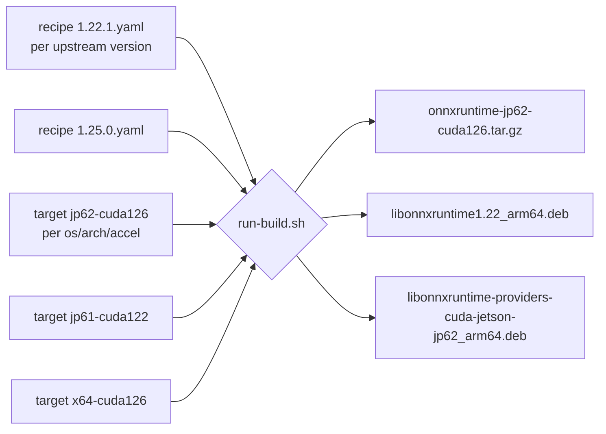

# Architecture

This document captures the design conventions of `EdgeFirstAI/packaging` that aren't immediately obvious from the README/TESTING and would otherwise need to be re-derived by every contributor.

If you only want to add a target for an existing recipe or build an existing target, you do not need this document — see [TESTING.md](TESTING.md). This document is for the people deciding *how* to add a new upstream library or a new packaging format (macOS, Windows).

## Mental model: recipe + target = build

A single recipe is consumed by N targets. Adding a new platform for an existing upstream version means adding a target, not editing the recipe. Adding a new upstream version means adding a new recipe and (usually) duplicating each existing target with the appropriate per-version adjustments — there is intentionally no "default target" inheritance.



Recipe responsibilities (the *what*):

- Upstream URL + SHA256
- Patches (per `upstream_version`)
- `build_layout` (file shape after build)
- License SPDX

Target responsibilities (the *where/how*):

- Build host: `runs_on`, `arch`, `os`
- Build flags (CMake / bazel / etc.)
- `packaging.formats` (tarball / deb / zip)
- `packaging.deb.binaries` (the four-package split)
- `depends` / `provides` / `conflicts`
- Post-build test path

The split rules out two anti-patterns we explicitly want to avoid:

- One YAML per (upstream_ver × target) combination. N×M files for trivial changes; copy-paste-and-tweak hell.
- A "default config" inheritance chain across versions. Subtle behavior drift when a flag added for one version silently applies to all.

## Naming conventions

### Package names

The directory name under `packages/` is the **published package name**, not the upstream project name. Examples:

| Directory | Upstream repo | Why different |
|---|---|---|
| `packages/onnxruntime/` | `microsoft/onnxruntime` | Same (happy case) |
| `packages/tflite/` | `tensorflow/tensorflow` | Upstream is one giant repo; we ship one library out of it |

When the recipe is consumed, `package-tarball.sh` / `package-deb.sh` read `upstream.upstream_name` (optional, falls back to the basename of `upstream.repo`) for display strings, and use the **directory name** as the published `<package>` slot in tag and filename schemes.

### Target keys

Target keys follow a `<os>-<arch>-<accel>` shape, e.g. `linux-aarch64-jp62-cuda126`. The key is **declared** in `target.yaml`'s top-level `key:` field and used in tarball filenames, `.deb` package suffixes, `BUILD_INFO.txt`, and GitHub release artifact names.

There is an intentional inconsistency between the target **directory name** and the published **target key**:

- Filesystem directory: `targets/linux-arm64-jp62-cuda126/`
- Published key: `linux-aarch64-jp62-cuda126`

The directory uses the Debian/dpkg architecture spelling (`arm64`) — this is what `dpkg --print-architecture` returns and what `--arch` expects when invoking `deb-s3`. The published key uses the kernel/uname spelling (`aarch64`) — this is what consumers see when they `uname -m` to figure out which tarball to download. Both spellings exist in the wild for the same CPU; we pick the right one for each audience instead of arguing.

> [!IMPORTANT]
> If you find this confusing, **don't try to "fix" it** — both audiences need the spelling they expect. Adding a third internal field that picks between them creates more confusion than it resolves.

## Where the recipe ends and the target begins

The hardest line to draw correctly. Rule of thumb:

| Property | Lives in | Why |
|---|---|---|
| Upstream URL + SHA | recipe | One upstream tag → one source archive |
| Patches list | recipe | Patches are for an upstream version, not a platform |
| Glob/path of main library output | recipe | Where upstream's build *writes* the artifact, with `${config}` substitution |
| List of plugin libraries that *might* be produced | recipe (`build_layout.libraries.extras`) | Each is conditionally present per target build flags |
| Headers to ship | recipe | The library's public API surface is upstream-version-specific |
| `output_dir` template (e.g. `build/Linux/${config}`) | recipe (for now — see Open issues) | Technically per-build-system: ORT's `build.sh` emits `build/<OS>/<config>/`; bazel emits `bazel-bin/<path>/`. For Linux ORT it's invariant; macOS ORT would need parametrizing. |
| Build flags (CUDA, CMake defines, bazel flags) | target | Per-target with recipe-level defaults that get merged |
| Debian binary split + depends/provides/conflicts | target | Architecture-specific, distro-specific |
| Test command to run after build | target | A CUDA-presence test only makes sense for CUDA targets |
| Build host requirements (`runs_on`) | target | Per-host, not per-source |

When you're unsure: ask "does every target build of this upstream version need this exact value?" If yes → recipe. If "depends on the target" → target.

## The four-package Debian split

For libraries with execution-provider plugins (ONNX Runtime today; potentially TensorRT EP, OpenVINO EP, etc. in the future), per-target builds produce up to four `.deb` files:

| Package | Example | What it contains | Why split out |
|---|---|---|---|
| `lib<name><soname>` | `libonnxruntime1.22` | Main library + SONAME chain | No accelerator linkage. Works on any compatible Linux of the same ABI generation. |
| `lib<name>-dev` | `libonnxruntime-dev` | Headers + `.so` linker symlink | Only needed at compile time. |
| `lib<name>-providers-shared` | `libonnxruntime-providers-shared` | EP loader framework (~8 KB) | Generic; all EP plugins need it. |
| `lib<name>-providers-<ep>-<target>` | `libonnxruntime-providers-cuda-jetson-jp62` | EP plugin tied to a specific accelerator version + sm_arch | `Provides:` + `Conflicts:` on the unsuffixed virtual name lets multiple EP variants coexist on disk while only one installs. |

For libraries **without** plugins (TensorFlow Lite C is the next expected example), the split collapses naturally to just the first two: `lib<name><soname>` + `lib<name>-dev`. The packager doesn't impose four packages — it produces however many entries are in `target.yaml`'s `packaging.deb.binaries[]`.

For a hypothetical 1-package leaf (a header-only library, or a single self-contained `.so` with no SONAME minor variation), declare a single binary entry; the script handles it transparently.

## Cross-platform packaging

Today: Linux only (tarball + deb). Near-term expansion:

| Platform | Tarball | Native package | Notes |
|---|---|---|---|
| Linux | `.tar.gz` | `.deb` | Working today |
| macOS | `.tar.gz` | (none) | Add macOS target with `packaging.formats: [tarball]`. The existing `package-tarball.sh` should work as-is; `package-deb.sh` is gated by `packaging.formats` containing `"deb"`. |
| Windows | `.zip` | (none) | Need to add `shared/package-zip.sh` (parallel to `package-tarball.sh`) and gate it on `packaging.formats: [zip]`. The `build_layout` schema mostly carries over — `libraries.main` would be `*.dll` + matching `*.lib` for the import library. |

The `packaging.formats` array in `target.yaml` already exists as the extensibility point. When you add macOS/Windows targets, the recipe's `build_layout` may need a per-OS variant for `output_dir` and for the library glob (`libonnxruntime.so*` vs `libonnxruntime.*.dylib` vs `onnxruntime.dll`). The cleanest path is probably something like:

```yaml
build_layout:
  output_dir:
    linux:   build/Linux/${config}
    macos:   build/MacOS/${config}
    windows: build/Windows/${config}
  libraries:
    main:
      linux:   libonnxruntime.so*
      macos:   libonnxruntime.*.dylib
      windows: onnxruntime.dll
```

…with `package-tarball.sh` reading `.build_layout.output_dir.${target_os}` instead of just `.build_layout.output_dir`.

> [!NOTE]
> **Don't do this yet** — wait until the first non-Linux target lands so the shape is driven by real need, not speculation. The current Linux-only schema works.

## Reproducibility model

Every published artifact stamps a `BUILD_INFO.txt` (in the tarball, and at `/usr/share/doc/<pkg>/BUILD_INFO.txt` in installed Debian packages) recording:

- Upstream tag and tarball SHA256 (pinned in the recipe)
- EdgeFirst build number (the `-edgefirst<n>` version suffix)
- Build host: hardware, OS/L4T version, CUDA + cuDNN versions
- Toolchain: gcc, cmake, ninja versions
- Recipe identity: which recipe yaml produced this artifact

A given tarball can be regenerated bit-for-bit if every recorded ingredient is reproduced. We don't currently verify this end-to-end in CI — that's an open issue, low priority.

## Open issues / future work

These are deliberate non-decisions or known gaps. None block the current ORT pipeline; revisit when concrete need arises.

- **macOS / Windows support**: see the per-OS `build_layout` proposal above. Driven by tflite or the first non-Linux ORT target.
- **`build_layout` for bazel-based projects**: tflite uses `bazel-bin/tensorflow/lite/c/` instead of `build/<OS>/${config}`. Different enough that recipe-level path templates may need a build-system-aware variant. See `packages/tflite/recipes/2.19.0.yaml` TODO comments.
- **JSON Schema for recipes/targets**: would catch typos and missing fields at lint time. Not yet worth it for two recipes. Reconsider at ~5+ recipes or after a real typo causes a failed build.
- **SBOM generation at packaging time**: per Au-Zone policy, no GPL/AGPL in dependency chains. Currently relies on upstream license audit; could add a check against the recipe's `build_layout.license` plus crawled SBOM at package time. See the `au-zone-sps:sbom` skill.
- **End-to-end reproducibility verification**: re-running a build of the same recipe + target + EdgeFirst build number on a clean host should produce a bit-identical tarball. Has never been measured.
- **Cleanup of `work/`**: each target writes to `work/<target_key>/`. Switching targets on the same host accumulates state. `run-build.sh` could `rm -rf work/<target_key>` at the start; today the operator is responsible.
- **Schema for non-C-API libraries**: a hypothetical Python wheel (`libtorch`'s python side) or a header-only library doesn't fit cleanly. YAGNI until the first concrete case.
- **One upstream → multiple packages**: e.g., `tensorflow/tensorflow` ships TFLite C + the full TF C API + the Python package. Currently modeled by separate `packages/<id>/` directories pointing at the same upstream repo with different recipes. Works fine; revisit only if patches need to be shared across packages.
