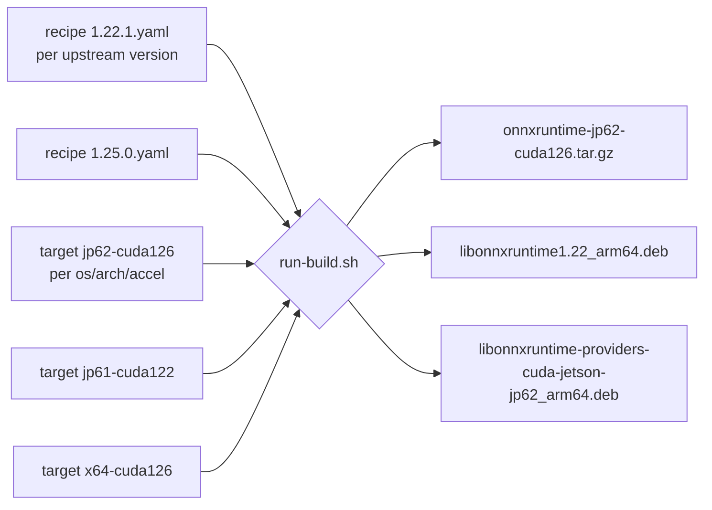

# Architecture

This document captures the design conventions of `EdgeFirstAI/packaging` that aren't immediately obvious from the README/TESTING and would otherwise need to be re-derived by every contributor.

If you only want to add a target for an existing recipe or build an existing target, you do not need this document — see [TESTING.md](TESTING.md). This document is for the people deciding *how* to add a new upstream library or a new packaging format (macOS, Windows).

## What this is (and isn't)

This is a **vendor-curated binary distribution** for a small set of ML/AI runtime libraries on the specific deployment and development platforms EdgeFirst targets. It is **not** a general-purpose package manager. It does not maintain a catalog of arbitrary software, does not resolve dependencies, and does not aspire to replace anything that already works for the user's platform.

The closest analogues in the wild are organization-scoped apt repositories like the ROS apt repos, the Eclipse Zenoh apt repo, NVIDIA's Jetson archive, and Ubuntu PPAs — each scoped to a specific project's deployment needs, each shipping pre-built binaries via the platform's native install path (`apt install`), each updating at a cadence the project controls rather than tracking upstream continuously.

Implications that shape the design:

- **Catalog stays small and intentional.** We package what EdgeFirst's deployments and engineering hosts actually need and that isn't already convenient from upstream or the platform's BSP. We do not pre-package "anything that might be useful." New packages are added as concrete gaps are identified.
- **Cadence is slow on purpose.** We pick stable upstream points and ship them for a long time. We do not chase upstream releases. The `<package>-<upstream_ver>-<build_n>` tag scheme makes the build-number axis the place we move; the upstream-version axis we move sparingly.
- **Consumers can opt out.** If upstream's binaries fit, or if the user prefers to compile from source, they should — these packages exist to save effort, not to be the canonical install path. Documentation should reflect this rather than implying the user needs us.
- **The build environment is pinned, not owned.** What matters for reproducibility is a known toolchain, not a physical box. CPU-only targets (tflite) build on GitHub-hosted ephemeral runners (a clean Ubuntu 22.04 baseline). The accelerated ONNX CUDA target builds on a GitHub-hosted *native aarch64* runner inside a pinned NVIDIA JetPack container — nvcc compiles `sm_87` without a GPU, and the container supplies the exact CUDA/cuDNN userspace, so the build is reproducible from a clean image with no owned Jetson in the loop. A clean ephemeral runner + pinned container is *more* reproducible than a long-lived self-hosted box. Each target chooses its runner (`runs_on:`) and optional build image (`build.container:`) in `target.yaml`; see TESTING.md "On-demand builds via GitHub Actions". The trade-off is that a GPU-less runner can't run a real CUDA session, so the ONNX target's post-build check is a static ABI verification (`cuda-ep-abi.sh`); full runtime validation is a manual on-Jetson step. We are not soliciting public CI contributions — dispatch is restricted to maintainers.

The mechanics that follow (recipe/target split, build_layout schema, four-package Debian rationale) borrow shape from Yocto, Homebrew, and nixpkgs because there's a small number of correct ways to model "fetch upstream tarball, optionally patch, build with these flags, lay out artifacts." The mechanics are similar; the audience and the catalog scope are not.

## Mental model: recipe + target = build

A single recipe is consumed by N targets. Adding a new platform for an existing upstream version means adding a target, not editing the recipe. Adding a new upstream version means adding a new recipe and (usually) duplicating each existing target with the appropriate per-version adjustments — there is intentionally no "default target" inheritance.



Recipe responsibilities (the *what*):

- Upstream URL + SHA256
- Patches (per `upstream_version`)
- `build_layout` (file shape after build)
- License SPDX

Target responsibilities (the *where/how*):

- Build host: `runs_on`, `arch`, `os`
- Build flags (CMake / bazel / etc.)
- `packaging.formats` (tarball / deb / zip)
- `packaging.deb.binaries` (the four-package split)
- `depends` / `provides` / `conflicts`
- Post-build test path

The split rules out two anti-patterns we explicitly want to avoid:

- One YAML per (upstream_ver × target) combination. N×M files for trivial changes; copy-paste-and-tweak hell.
- A "default config" inheritance chain across versions. Subtle behavior drift when a flag added for one version silently applies to all.

## Naming conventions

### Package names

The directory name under `packages/` is the **published package name**, not the upstream project name. Examples:

| Directory | Upstream repo | Why different |
|---|---|---|
| `packages/onnxruntime/` | `microsoft/onnxruntime` | Same (happy case) |
| `packages/tflite/` | `tensorflow/tensorflow` | Upstream is one giant repo; we ship one library out of it |

When the recipe is consumed, `package-tarball.sh` / `package-deb.sh` read `upstream.upstream_name` (optional, falls back to the basename of `upstream.repo`) for display strings, and use the **directory name** as the published `<package>` slot in tag and filename schemes.

### Target keys

Target keys follow a `<os>-<arch>-<accel>` shape, e.g. `linux-aarch64-jp62-cuda126`. The key is **declared** in `target.yaml`'s top-level `key:` field and used in tarball filenames, `.deb` package suffixes, `BUILD_INFO.txt`, and GitHub release artifact names.

There is an intentional inconsistency between the target **directory name** and the published **target key**:

- Filesystem directory: `targets/linux-arm64-jp62-cuda126/`
- Published key: `linux-aarch64-jp62-cuda126`

The directory uses the Debian/dpkg architecture spelling (`arm64`) — this is what `dpkg --print-architecture` returns and what `--arch` expects when invoking `deb-s3`. The published key uses the kernel/uname spelling (`aarch64`) — this is what consumers see when they `uname -m` to figure out which tarball to download. Both spellings exist in the wild for the same CPU; we pick the right one for each audience instead of arguing.

> [!IMPORTANT]
> If you find this confusing, **don't try to "fix" it** — both audiences need the spelling they expect. Adding a third internal field that picks between them creates more confusion than it resolves.

## Where the recipe ends and the target begins

The hardest line to draw correctly. Rule of thumb:

| Property | Lives in | Why |
|---|---|---|
| Upstream URL + SHA | recipe | One upstream tag → one source archive |
| Patches list | recipe | Patches are for an upstream version, not a platform |
| Glob/path of main library output | recipe | Where upstream's build *writes* the artifact, with `${config}` substitution |
| List of plugin libraries that *might* be produced | recipe (`build_layout.libraries.extras`) | Each is conditionally present per target build flags |
| Headers to ship | recipe | The library's public API surface is upstream-version-specific. Each `build_layout.headers` entry is either a bare string (staged flat to `include/<basename>`, as ORT does) or a `{src, dest}` map (staged at `include/<dest>`, preserving a nested tree, as tflite needs for `include/tensorflow/lite/c/`). |
| `output_dir` template (e.g. `build/Linux/${config}`) | recipe (for now — see Open issues) | Technically per-build-system: ORT's `build.sh` emits `build/<OS>/<config>/`; bazel emits `bazel-bin/<path>/`. For Linux ORT it's invariant; macOS ORT would need parametrizing. |
| Build flags (CUDA, CMake defines, bazel flags) | target | Per-target with recipe-level defaults that get merged |
| Debian binary split + depends/provides/conflicts | target | Architecture-specific, distro-specific |
| Test command to run after build | target | A CUDA-presence test only makes sense for CUDA targets |
| Build host requirements (`runs_on`) | target | Per-host, not per-source |

When you're unsure: ask "does every target build of this upstream version need this exact value?" If yes → recipe. If "depends on the target" → target.

## The four-package Debian split

For libraries with execution-provider plugins (ONNX Runtime today; potentially TensorRT EP, OpenVINO EP, etc. in the future), per-target builds produce up to four `.deb` files:

| Package | Example | What it contains | Why split out |
|---|---|---|---|
| `lib<name><soname>` | `libonnxruntime1.22` | Main library + SONAME chain | No accelerator linkage. Works on any compatible Linux of the same ABI generation. |
| `lib<name>-dev` | *(not shipped for onnxruntime)* | Headers + `.so` linker symlink | Only needed at compile time. **onnxruntime omits this** — see below. |
| `lib<name>-providers-shared` | `libonnxruntime-providers-shared` | EP loader framework (~8 KB) | Generic; all EP plugins need it. |
| `lib<name>-providers-<ep>-<target>` | `libonnxruntime-providers-cuda-jetson-jp62` | EP plugin tied to a specific accelerator version + sm_arch | `Provides:` + `Conflicts:` on the unsuffixed virtual name lets multiple EP variants coexist on disk while only one installs. |

**No `-dev` packages are shipped, for either library.** EdgeFirst consumes both ONNX Runtime and TensorFlow Lite purely via runtime loading (`dlopen` / the Rust `ort` crate) — no headers, no link-time `-lonnxruntime`/`-ltensorflowlite_c` — so a `-dev` package serves no consumer. For onnxruntime, omitting it also removes the *only* apt name collision with distros that now ship their own onnxruntime: Ubuntu 24.04+/Debian use the package name `libonnxruntime-dev`, while our base lib uses the unique versioned name `libonnxruntime1.22` and a version-specific SONAME file `libonnxruntime.so.1.22` (not the bare-major `libonnxruntime.so.1` — see the SONAME note below), neither of which collide. The unversioned `libonnxruntime.so` dev symlink — the one that *would* collide — lived only in `-dev`. Headers are still bundled in each release tarball under `include/` for anyone who wants them.

The packager doesn't impose four packages — it produces however many entries are in `target.yaml`'s `packaging.deb.binaries[]`. TensorFlow Lite C, having no EP plugins and no `-dev`, collapses to a single `libtensorflowlite-c`.

For a hypothetical 1-package leaf (a header-only library, or a single self-contained `.so` with no SONAME minor variation), declare a single binary entry; the script handles it transparently.

### Layered ONNX packaging: base built once per arch, EP per accelerator

The packages above are *not* all produced by one target. They are split across targets by what is arch-generic vs accelerator-specific:

- The **base lib and `-providers-shared`** carry no CUDA linkage, so they are built **once per architecture** by a CPU target (`onnxruntime/targets/linux-x86_64`, `…/linux-aarch64`) on a clean Ubuntu 22.04 runner. `apt install libonnxruntime1.22` resolves the base on any host, CUDA or not. (No `-dev` is produced — see the note above.)
- The **EP plugin package** is built by the accelerator target (`…/linux-aarch64-jp62-cuda126`, in the JetPack container) which packages **only** `lib<name>-providers-<ep>-<target>`. Its CUDA build still produces a base lib, but we don't package it as a `.deb` — that would collide with the CPU target's `libonnxruntime1.22_<arch>.deb` (same name + arch + version) on release. The accelerator target's **tarball**, however, still bundles the full set (base + EP + headers) for a self-contained airgapped install.

This keeps every `(package-name, arch)` produced by exactly one target (no `.deb` collisions in the release/APT repo) and means the CUDA EP layers onto the same base any CPU host already has. The cross-build ABI assumption — an EP plugin built in the JetPack container loads against a base/`providers-shared` built by the CPU target — holds because both come from the same ORT recipe version + build number (the provider-bridge ABI is stable within a release); validated on real Jetson hardware (TESTING.md on-device acceptance).

#### Version-specific SONAME

The base lib ships with a **version-specific soname** — `libonnxruntime.so.1.22` (the real file `libonnxruntime.so.1.22.1`) — rather than ORT's default bare-major `libonnxruntime.so.1`. This matches the distro convention (Ubuntu's package is `libonnxruntime1.23` with soname `libonnxruntime.so.1.23`) and, more importantly, ensures our **older** 1.22 runtime is never picked up generically: a system or app resolving a bare `libonnxruntime.so.1` (or ldconfig publishing it) must not silently load our older build in place of a newer system onnxruntime. Only an explicit version-specific `dlopen` gets ours. The recipe opts in via `build_layout.libraries.version_soname: true`; `run-build.sh` applies it **after** the test stage and **before** packaging (the test dlopens ORT's default `.so`), using `patchelf --set-soname` plus a symlink rebuild — safe because nothing in the package graph links `libonnxruntime` via `NEEDED` (the providers use the runtime bridge + global symbol resolution, confirmed on-device). Build hosts therefore need `patchelf`. The unversioned `.so` and bare-major `.so.1` symlinks are dropped; consumers `dlopen` the version-specific name.

> [!NOTE]
> The verification stage reflects this split: the accelerator target's `cuda-ep-abi.sh` statically asserts the EP links the expected CUDA/cuDNN majors **and** that the base/`providers-shared` libs are CUDA-free; the CPU targets run a `dlopen` smoke test (`ort-load.sh`).

## Cross-platform packaging

Today: Linux only (tarball + deb). Near-term expansion:

| Platform | Tarball | Native package | Notes |
|---|---|---|---|
| Linux | `.tar.gz` | `.deb` | Working today |
| macOS | `.tar.gz` | (none) | Add macOS target with `packaging.formats: [tarball]`. The existing `package-tarball.sh` should work as-is; `package-deb.sh` is gated by `packaging.formats` containing `"deb"`. |
| Windows | `.zip` | (none) | Need to add `shared/package-zip.sh` (parallel to `package-tarball.sh`) and gate it on `packaging.formats: [zip]`. The `build_layout` schema mostly carries over — `libraries.main` would be `*.dll` + matching `*.lib` for the import library. |

The `packaging.formats` array in `target.yaml` already exists as the extensibility point. When you add macOS/Windows targets, the recipe's `build_layout` may need a per-OS variant for `output_dir` and for the library glob (`libonnxruntime.so*` vs `libonnxruntime.*.dylib` vs `onnxruntime.dll`). The cleanest path is probably something like:

```yaml
build_layout:
  output_dir:
    linux:   build/Linux/${config}
    macos:   build/MacOS/${config}
    windows: build/Windows/${config}
  libraries:
    main:
      linux:   libonnxruntime.so*
      macos:   libonnxruntime.*.dylib
      windows: onnxruntime.dll
```

…with `package-tarball.sh` reading `.build_layout.output_dir.${target_os}` instead of just `.build_layout.output_dir`.

> [!NOTE]
> **Don't do this yet** — wait until the first non-Linux target lands so the shape is driven by real need, not speculation. The current Linux-only schema works.

## Reproducibility model

Every published artifact stamps a `BUILD_INFO.txt` (in the tarball, and at `/usr/share/doc/<pkg>/BUILD_INFO.txt` in installed Debian packages) recording:

- Upstream tag and tarball SHA256 (pinned in the recipe)
- EdgeFirst build number (the `-edgefirst<n>` version suffix)
- Build host: hardware, OS/L4T version, CUDA + cuDNN versions
- Toolchain: gcc, cmake, ninja versions
- Recipe identity: which recipe yaml produced this artifact

A given tarball can be regenerated bit-for-bit if every recorded ingredient is reproduced. We don't currently verify this end-to-end in CI — that's an open issue, low priority.

## Open issues / future work

These are deliberate non-decisions or known gaps. None block the current ORT pipeline; revisit when concrete need arises.

- **macOS / Windows support**: see the per-OS `build_layout` proposal above. Driven by the first non-Linux ORT target (tflite intentionally excludes macOS/Windows — those platforms are served by ONNX Runtime in EdgeFirst deployments).
- **x86-64 CUDA execution provider** (desktop/datacenter GPUs): planned. Today ONNX ships CPU on x86-64 and CUDA only on Jetson (aarch64). A desktop x86-64 CUDA EP would be a new accelerator target (e.g. `onnxruntime/targets/linux-x86_64-cuda`) layering an EP package onto the existing CPU base — built in an `nvidia/cuda:12.x-devel-ubuntu22.04` container with a multi-arch `CMAKE_CUDA_ARCHITECTURES` (sm_75/80/86/89/90), and `depends` on the **x86-64 CUDA-repo** package names (`libcudart12`, etc., which exist there — unlike the Jetson dependency-name question below). Deferred as a follow-up project, not blocking the current CPU + Jetson matrix.
- ~~**Verify the Jetson CUDA EP `depends` package names**~~ **(RESOLVED 2026-06-14)**: the EP package originally depended on the Debian/Ubuntu CUDA-repo spellings (`libcudart12`, `libcublas12`, `libcufft11`, `libcudnn9`), which **do not exist on JetPack** — an on-device `apt install` dry-run on a real JetPack 6.2 (L4T R36.4.7) Orin reported all four as "not installable". JetPack ships CUDA via the `l4t-cuda`/`cudnn-local` tegra apt repos under versioned names. The `depends` are now the verified JetPack spellings: `cuda-cudart-12-6`, `libcublas-12-6` (provides both `libcublas.so.12` and `libcublasLt.so.12`), `libcufft-12-6`, `libcudnn9-cuda-12`, `nvidia-l4t-core (>= 36.4)`. This confirmed the static ABI check (SONAME *linkage*) and apt *depends* are separate axes — the build passed the former while shipping wrong names for the latter, caught only by on-device acceptance testing (see TESTING.md).
- **`build_layout` for bazel-based projects**: not currently needed. tflite turned out to build via CMake (its C API ships a self-contained `tensorflow/lite/c/CMakeLists.txt`), writing to `_build/` — close enough to ORT's `build/<OS>/${config}` that the existing scalar `output_dir` covers it. A genuinely bazel-built package (one whose output lands under `bazel-bin/<path>/`) would still want a build-system-aware `output_dir` variant; revisit if one is added.
- **JSON Schema for recipes/targets**: would catch typos and missing fields at lint time. Not yet worth it for two recipes. Reconsider at ~5+ recipes or after a real typo causes a failed build.
- **SBOM generation at packaging time**: per Au-Zone policy, no GPL/AGPL in dependency chains. Currently relies on upstream license audit; could add a check against the recipe's `build_layout.license` plus crawled SBOM at package time. See the `au-zone-sps:sbom` skill.
- **End-to-end reproducibility verification**: re-running a build of the same recipe + target + EdgeFirst build number on a clean host should produce a bit-identical tarball. Has never been measured.
- **Cleanup of `work/`**: each target writes to `work/<target_key>/`. Switching targets on the same host accumulates state. `run-build.sh` could `rm -rf work/<target_key>` at the start; today the operator is responsible.
- **Schema for non-C-API libraries**: a hypothetical Python wheel (`libtorch`'s python side) or a header-only library doesn't fit cleanly. YAGNI until the first concrete case.
- **One upstream → multiple packages**: e.g., `tensorflow/tensorflow` ships TFLite C + the full TF C API + the Python package. Currently modeled by separate `packages/<id>/` directories pointing at the same upstream repo with different recipes. Works fine; revisit only if patches need to be shared across packages.
