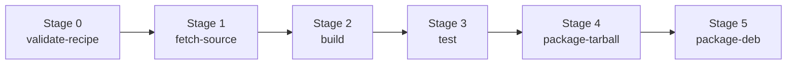

# Building, testing, and releasing

This document covers the build, test, and release workflow for maintainers of the `EdgeFirstAI/packaging` repository. End-user installation instructions are in [README.md](README.md). The design rationale behind the recipe/target split and the naming conventions is in [ARCHITECTURE.md](ARCHITECTURE.md).

## Build model

Each build runs one command (`shared/run-build.sh`) to produce artifacts for one `(package, target)` pair, then uploads them to a draft GitHub Release and publishes to the apt repository. The host a target builds on is whatever its `runs_on:` declares — current targets all build on GitHub-hosted runners:

| Target family | Build host | How the toolchain is supplied |
|---|---|---|
| ONNX Runtime CPU (linux-x86_64) | `ubuntu-22.04` | build-essential/CMake/Ninja apt-installed on the runner. |
| ONNX Runtime CPU (linux-aarch64) | `ubuntu-22.04-arm` | build-essential/CMake/Ninja apt-installed on the runner. |
| ONNX Runtime CUDA (linux-aarch64-jp62-cuda126) | `ubuntu-24.04-arm-xlarge` (native aarch64, GPU-less) | Builds inside the matching NVIDIA JetPack container (`build.container`); nvcc compiles sm_87 without a GPU. Packages the CUDA EP only — base lib comes from the CPU aarch64 target. |
| tflite (linux-x86_64 / aarch64) | `ubuntu-22.04` / `ubuntu-22.04-arm` | CMake/Ninja apt-installed on the runner. |
| macOS / Windows | not provided | served by ONNX Runtime in EdgeFirst deployments. |

ONNX Runtime's arch-generic packages (base lib, `-dev`, `-providers-shared`) are built once per arch by the CPU targets and carry no CUDA linkage; the CUDA execution provider is a separate package layered on top by the Jetson target. See [ARCHITECTURE.md](ARCHITECTURE.md) "Layered ONNX packaging".

The same command also runs locally on any host that satisfies a target's toolchain — see [Build host requirements](#build-host-requirements). The CUDA target additionally builds on a real Jetson if you point `run-build.sh` at it from a Jetson shell; CI just uses the container so no Jetson is required.

## Repository layout

Per-package directories:

- `packages/<upstream>/recipes/<version>.yaml` — per-upstream-version metadata: upstream URL, SHA256 pin, patches list, `build_layout`, `build_defaults`.
- `packages/<upstream>/patches/<version>/` — optional, created only when a recipe actually needs patches. Per-version subdirs avoid same-name patches colliding across upstream versions.
- `packages/<upstream>/targets/<key>/target.yaml` — per-(os, arch, accelerator) config: arch, runner labels, `packaging.deb.binaries`.
- `packages/<upstream>/targets/<key>/build.sh` — wraps the upstream build with target-specific flags.

> [!NOTE]
> The target **directory** uses the dpkg architecture spelling (`arm64`); the target **key** in `target.yaml` uses the kernel/uname spelling (`aarch64`). See [ARCHITECTURE.md](ARCHITECTURE.md) "Naming conventions" for why.

Shared, generic scripts under `shared/`:

| Script | Role |
|---|---|
| `run-build.sh` | End-to-end orchestrator. |
| `validate-recipe.sh` | Stage-0 fast-fail check for recipe + target YAML. |
| `fetch-source.sh` | Download tarball, verify SHA256, extract, apply patches. |
| `package-tarball.sh` | Produce `.tar.gz` + `.sha256`, driven by `recipe.build_layout`. |
| `package-deb.sh` | Produce `.deb` files, driven by `target.packaging.deb.binaries`. |
| `publish-apt.sh` | Upload `.deb` files to S3 and invalidate CloudFront. |
| `lib/common.sh` | Helpers sourced by the above (`require_cmd`, `sha256_hex`, `sha256_line`, `load_recipe_identity`, `yq_or`). |
| `tests/cuda-ep-abi.sh` | GPU-free post-build verification for the CUDA ORT build (static ELF/ABI check: CUDA EP links the right majors; base libs are CUDA-free). |
| `tests/ort-load.sh` | Post-build smoke test for CPU ONNX builds (`dlopen` libonnxruntime.so + resolve `OrtGetApiBase`). |
| `tests/cuda-ep-present.sh` | Runtime CUDA verification — needs a real GPU; for manual on-Jetson validation only. |
| `tests/tflite-load.sh` | Post-build smoke test for the tflite C API (`dlopen` + symbol resolve). |

A recipe is **upstream-version-specific** (one per upstream tag) and describes how to fetch + patch + lay out the source. A target is **target-tuple-specific** (one per `(os, arch, accelerator)` combo) and describes how to build + package + name the artifacts. The same target can build different upstream versions by selecting different recipes.

## Build host requirements

### All Linux targets

- gcc/g++ ≥ 11 (C++17 + ARMv8.2-A FP16 support on aarch64)
- python3 + `python3-venv` (to provision a fresh cmake)
- ninja, dpkg-dev (for `.deb` output)
- wget, curl, tar, patch, sha256sum
- yq (mikefarah's Go version, **not** the python one)

`run-build.sh` provisions cmake into a per-build venv at `work/.../venv/`, pinned to the last 3.x release (≥ 3.28, < 4.0) to avoid CMake 4's removal of pre-3.5 policies that breaks some transitive deps.

### ONNX Runtime CUDA (linux-aarch64-jp62-cuda126)

CI builds this on a GitHub-hosted **native aarch64** runner (`ubuntu-24.04-arm-xlarge`, set in the target's `runs_on:`) inside the JetPack container named in the target's `build.container:` — no physical Jetson and no GPU required. The mechanics that make this work:

- **nvcc needs no GPU at build time.** It compiles device code for `sm_87` offline; only *running* CUDA needs a GPU. The recipe/target pass `CMAKE_CUDA_ARCHITECTURES=87`, so ORT's CMake never probes for a present GPU.
- **Native, not emulated.** An aarch64 JetPack image on an aarch64 runner runs with no QEMU; Docker is preinstalled on the hosted runners.
- **The container is the ABI source of truth.** `nvcr.io/nvidia/l4t-jetpack:r36.4.3` (JetPack 6.2) supplies CUDA 12.6 + cuDNN 9.3. It must match the deployment JetPack — verify the tag and CUDA/cuDNN versions against the [NGC catalog](https://catalog.ngc.nvidia.com/orgs/nvidia/containers/l4t-jetpack) before a release. The `.deb` depends and `cuda-ep-abi.sh` cross-check the CUDA 12 / cuDNN 9 majors.
- **Verification is static.** A GPU-less runner can't instantiate a CUDA session, so the post-build test (`cuda-ep-abi.sh`) confirms via `readelf` that the CUDA EP plugin built and links the expected cuDNN/CUDA majors. For end-to-end runtime validation, run `shared/tests/cuda-ep-present.sh` manually on a real Jetson.
- **Memory/parallelism.** ORT's cutlass/BERT CUDA kernels are RAM-hungry — `-j4` OOMs on ~8 GB (hence `parallel: 2` and the xlarge 16 GB runner). On 16 GB, `-j4` may fit; override per run with `PARALLEL=N`.

To build this target on an actual Jetson instead (manual, no container), run `run-build.sh` from a Jetson Orin shell on the targeted JetPack; set power mode first with `sudo nvpmodel -m <max-perf-mode> && sudo jetson_clocks` (confirm the mode number with `nvpmodel -p --verbose` — it differs across Orin variants) and add a 16 GB disk swapfile if you raise parallelism past `-j2`.

### tflite (Linux x86_64 / aarch64)

CPU-only CMake builds; no special hardware. A generic Linux host (matching the target arch) with gcc/g++ ≥ 11, cmake, ninja, and `dpkg-dev` suffices. Unlike the ORT Jetson target, the aarch64 tflite build does **not** require physical Jetson hardware — any aarch64 Linux host works. Default `--parallel 2` (TFLite C++ compilation is memory-hungry; mirrors the upstream CI cap); raise with `PARALLEL=N` on a larger host.

### macOS / Windows specifics

Not implemented. EdgeFirst ships ONNX Runtime, not tflite, on those platforms, so no macOS or Windows targets exist. If ever added, see ARCHITECTURE.md "Cross-platform packaging" for the `.zip` packaging and per-OS `build_layout` work required.

## Building a target — one command

On a host that satisfies the target's toolchain requirements:

```bash
# Clone the packaging repo
git clone git@github.com:EdgeFirstAI/packaging.git
cd packaging

# Install yq (mikefarah's Go version)
sudo wget -qO /usr/local/bin/yq \
    https://github.com/mikefarah/yq/releases/latest/download/yq_linux_$(dpkg --print-architecture)
sudo chmod +x /usr/local/bin/yq

# Run the end-to-end build. Third arg = EdgeFirst build number (defaults to 1).
shared/run-build.sh \
    packages/onnxruntime/recipes/1.22.1.yaml \
    packages/onnxruntime/targets/linux-arm64-jp62-cuda126 \
    3
```

The orchestrator runs six stages in order:



Stage-by-stage:

0. **Validate** — `validate-recipe.sh` checks the recipe and target YAML for required fields, valid SHA256 syntax, patch file existence, and Debian binary metadata. Fails in seconds rather than after a 90-minute build if the inputs are malformed. Can also be run standalone: `shared/validate-recipe.sh packages/onnxruntime/recipes/1.22.1.yaml packages/onnxruntime/targets/linux-arm64-jp62-cuda126`.
1. **Fetch source** — `fetch-source.sh` downloads the upstream release tarball from the URL in the recipe, verifies its SHA256 against the recipe pin (writing back to the recipe on first fetch if unpinned), extracts to `work/<target_key>/source/`, and applies any patches listed in the recipe.
2. **Build** — `targets/<key>/build.sh` invokes the upstream build (ORT's `build.sh`, tflite's CMake project at `tensorflow/lite/c/`, etc.) with the flags assembled from `recipes/<ver>.yaml` `build_defaults` and `targets/<key>/target.yaml` `build` (target values win on conflict).
3. **Test** — the per-target verification declared in `target.yaml`'s `test:` field is run. For CUDA targets, that's `shared/tests/cuda-ep-abi.sh`, which uses `readelf` to confirm the CUDA EP plugin exists and links the expected CUDA 12 / cuDNN 9 SONAME majors — a GPU-free static check that catches the classic silent ABI break without requiring a GPU. (The runtime probe `shared/tests/cuda-ep-present.sh` is retained for manual on-Jetson validation.)
4. **Package tarball** — `package-tarball.sh` reads `recipe.build_layout` to know which libraries, headers, and doc files to stage; produces `.tar.gz` + `.sha256`. `cp -P` preserves the SONAME symlink chain.
5. **Package deb** — `package-deb.sh` reads `target.packaging.deb.binaries` and produces one `.deb` per declared binary via `dpkg-deb`, with control files and `Provides`/`Conflicts`/`Replaces` set per the target metadata.

Artifacts land under `work/<target_key>/dist/` (gitignored — nothing inside `work/` is meant to be committed). For the Jetson Orin target above, that produces:

- `onnxruntime-linux-aarch64-jp62-cuda126.tar.gz` (+ `.sha256` sidecar)
- `deb/libonnxruntime1.22_1.22.1-edgefirst3_arm64.deb`
- `deb/libonnxruntime-dev_1.22.1-edgefirst3_arm64.deb`
- `deb/libonnxruntime-providers-shared_1.22.1-edgefirst3_arm64.deb`
- `deb/libonnxruntime-providers-cuda-jetson-jp62_1.22.1-edgefirst3_arm64.deb`
- Each `.deb` has a corresponding `.sha256` sidecar.

Build cost is dominated by step 2 (~90 min on Jetson Orin Nano Super, ~10–20 min on a server-class build host). Most of that is ORT's `--use_cuda` compilation of CUDA EP kernels; non-CUDA targets are much faster.

## On-demand builds via GitHub Actions

The manual `run-build.sh` flow above is also wired up as a dispatchable workflow so a build can be reproduced on the correct hardware without shell access to each host.

- **`.github/workflows/build-target.yml`** — reusable (`workflow_call`) wrapper around `run-build.sh` for one `(recipe, target)` pair. Its `runs-on` comes from the target's `runs_on:` field. If the target sets `build.container:`, the build runs inside that image (the ONNX CUDA target builds in a JetPack container on `ubuntu-24.04-arm-xlarge`); otherwise it builds directly on the runner (tflite on `ubuntu-22.04` / `ubuntu-22.04-arm`). Host toolchain is apt-installed only for direct (non-container) builds on GitHub-hosted runners; container builds install their toolchain inside the image, and any self-hosted host is assumed pre-provisioned.
- **`.github/workflows/release.yml`** — the dispatch entry point (Actions → "Build & Release" → *Run workflow*). It discovers the package's targets from their `target.yaml` files, fans `build-target.yml` out across them, and optionally publishes.

Dispatch inputs:

| Input | Meaning |
|---|---|
| `package` | `onnxruntime` or `tflite` |
| `recipe_version` | recipe filename without `.yaml` (e.g. `1.22.1`, `2.19.0`) |
| `build_number` | EdgeFirst build number (bump for rebuilds at the same upstream version) |
| `targets` | comma-separated target keys, or `all` |
| `publish` | `false` = downloadable workflow artifacts only (no secrets needed); `true` = create the draft release, attach each target's assets, push `.debs` to APT, then flip the release to published |

Because the runner is read from `runs_on:`, **adding a target needs no workflow change** — drop in `targets/<key>/` and it shows up in the next dispatch. A target whose `runs_on` names a self-hosted label only runs if such a runner is registered and online.

Publishing (`publish: true`) requires these repository secrets (same values the manual `publish-apt.sh` flow uses):

| Secret | Purpose |
|---|---|
| `AWS_ACCESS_KEY_ID`, `AWS_SECRET_ACCESS_KEY` | S3 write + CloudFront invalidate |
| `APT_GPG_PRIVATE_KEY` | base64 of the armored APT signing private key (imported into the runner's keyring) |
| `APT_GPG_KEY_ID` | signing key fingerprint passed to `deb-s3 --sign` |
| `EDGEFIRST_CLOUDFRONT_DIST_ID` | CloudFront distribution id (or `skip` to omit invalidation) |

The matrix uses `fail-fast: false`, and the publish job depends on all builds succeeding — a single failed target leaves the release in draft (nothing is published) so you can rebuild just that target and re-dispatch. The manual flow below remains valid for one-off or air-gapped releases and documents the same steps the workflow automates.

## Cutting a release

A release collects artifacts from multiple build hosts under one tag, then publishes both to GitHub Releases (immutable archive) and to the APT repository (apt-installable).

### Tag schema

Tags follow `<package>-<upstream_ver>-<build_n>`, e.g.:

- `onnxruntime-1.22.1-3` — third EdgeFirst build of upstream ORT 1.22.1
- `tflite-2.20.0-1` — first EdgeFirst build of upstream TF 2.20.0

Increment `<build_n>` when packaging or compilation flags change without an upstream version bump.

### One-time setup: GPG signing key

The APT repository signs its `Release` metadata with a GPG key so consumers can verify package integrity. We use a dedicated key for this purpose.

To generate a new EdgeFirst APT signing key on a workstation you control:

```bash
# Generate the key (RSA 4096, no expiry, dedicated name and email).
# Use a strong passphrase or '%no-protection' if the key will live in CI.
cat > /tmp/edgefirst-apt-key.batch <<EOF
%echo Generating EdgeFirst APT signing key
Key-Type: RSA
Key-Length: 4096
Subkey-Type: RSA
Subkey-Length: 4096
Name-Real: EdgeFirst APT Repository
Name-Email: apt@edgefirst.ai
Expire-Date: 0
%no-protection
%commit
%echo done
EOF

gpg --batch --gen-key /tmp/edgefirst-apt-key.batch
rm /tmp/edgefirst-apt-key.batch

# Get the key fingerprint — this is APT_GPG_KEY_ID for deb-s3.
gpg --list-secret-keys --keyid-format LONG apt@edgefirst.ai

# Export the PUBLIC key for the apt repo — consumers download this.
gpg --armor --export apt@edgefirst.ai > edgefirst-archive-keyring.asc
gpg --export apt@edgefirst.ai > edgefirst-archive-keyring.gpg

# Upload edgefirst-archive-keyring.gpg to s3://edgefirst-repo/apt/ (root,
# not inside dists/) so curl https://repo.edgefirst.ai/apt/edgefirst-archive-keyring.gpg
# works for consumers.
aws s3 cp edgefirst-archive-keyring.gpg s3://edgefirst-repo/apt/ \
    --acl public-read --region us-west-2

# Export the PRIVATE key for storage in CI secrets (base64 because GH
# Actions secrets are single-line).
gpg --armor --export-secret-keys apt@edgefirst.ai | base64 \
    > edgefirst-apt-private-key.b64

# Store edgefirst-apt-private-key.b64 securely (1Password, AWS Secrets
# Manager, etc.) AND set GH repo secrets:
#   APT_GPG_PRIVATE_KEY = (contents of edgefirst-apt-private-key.b64)
#   APT_GPG_KEY_ID      = (fingerprint from --list-secret-keys above)
```

For local releases (no CI): keep the private key in your local gpg keyring and just set `APT_GPG_KEY_ID` when invoking `publish-apt.sh`.

### Release flow

```bash
# Decide on the tag.
TAG=onnxruntime-1.22.1-3
PKG=onnxruntime
# TARGET_DIR = the target directory (dpkg architecture spelling: arm64, amd64).
# TARGET_KEY = the published key (uname spelling: aarch64, x86_64) — read from target.yaml,
# used for work/ paths and artifact names. See ARCHITECTURE.md "Naming conventions".
TARGET_DIR=linux-arm64-jp62-cuda126
TARGET_KEY=linux-aarch64-jp62-cuda126

# 1. On any host (typically the dev machine) — create the empty draft release.
gh release create $TAG \
    --repo EdgeFirstAI/packaging \
    --draft \
    --title "EdgeFirst $PKG $TAG" \
    --notes "EdgeFirst build 3 of upstream ONNX Runtime v1.22.1.

Adds onnxruntime_ENABLE_CPU_FP16_OPS=ON for hardware-accelerated FP16
on CPUs that support ARMv8.2-A FP16 arithmetic (Cortex-A78 on Jetson Orin,
Cortex-A55/A75/A76, Neoverse-N1+). CPUs without these instructions
(A53/A57) fall back to FP32 promotion automatically via MLAS runtime
dispatch."

# 2. On each build host — produce artifacts then upload.
# For the ONNX CUDA target, CI uses a hosted aarch64 runner + JetPack container
# (no physical Jetson required). For a manual on-Jetson build, ssh in first:
#   ssh orin-nano && cd packaging
shared/run-build.sh \
    packages/$PKG/recipes/1.22.1.yaml \
    packages/$PKG/targets/$TARGET_DIR \
    3

# Upload tarball + .deb files to the GH release.
gh release upload $TAG \
    --repo EdgeFirstAI/packaging \
    work/$TARGET_KEY/dist/*.tar.gz \
    work/$TARGET_KEY/dist/*.sha256 \
    work/$TARGET_KEY/dist/deb/*.deb \
    work/$TARGET_KEY/dist/deb/*.sha256

# 3. Publish to the APT repository (from any host with AWS creds + GPG key).
#    Required env: APT_GPG_KEY_ID, AWS_ACCESS_KEY_ID, AWS_SECRET_ACCESS_KEY,
#                  EDGEFIRST_CLOUDFRONT_DIST_ID.
export APT_GPG_KEY_ID=<fingerprint>
export EDGEFIRST_CLOUDFRONT_DIST_ID=<distribution id>
shared/publish-apt.sh work/$TARGET_KEY/dist/deb/*.deb

# 4. When all expected targets are attached to the GH release, flip from
#    draft to published.
gh release edit $TAG \
    --repo EdgeFirstAI/packaging \
    --draft=false
```

This pattern lets each build host upload independently. A failed build on one target doesn't block another; rebuilding a target and re-uploading replaces only its assets in the GH release and re-publishes to apt.

### `publish-apt.sh` mechanics

`publish-apt.sh` wraps `deb-s3` (Ruby gem; install via `gem install deb-s3`) and `aws cloudfront create-invalidation`. It:

1. Validates inputs (all `.deb` files exist; readable).
2. Confirms the GPG signing key is in the local keyring.
3. Groups inputs by architecture (deb-s3 takes one `--arch` per invocation).
4. For each architecture, runs `deb-s3 upload --lock --sign $APT_GPG_KEY_ID --bucket edgefirst-repo --prefix apt --codename stable --visibility public`. The `--lock` uses an S3 lock object to serialize concurrent publishes.
5. Invalidates `/<prefix>/dists/*` in CloudFront so consumers see the new `Packages.gz` / `Release` / `InRelease` immediately. Set `EDGEFIRST_CLOUDFRONT_DIST_ID=skip` to omit this step (useful for testing).

### Default infrastructure values

These are baked in as defaults in `publish-apt.sh`; override per invocation via env vars if needed:

| Setting | Default | Env override |
|---|---|---|
| S3 bucket | `edgefirst-repo` | `EDGEFIRST_APT_BUCKET` |
| S3 prefix | `apt` | `EDGEFIRST_APT_PREFIX` |
| S3 region | `us-west-2` | `EDGEFIRST_APT_REGION` |
| Codename | `stable` | `EDGEFIRST_APT_CODENAME` |
| Visibility | `public` | `EDGEFIRST_APT_VISIBILITY` |

## Architectural choices

### Three-layer Debian split (libraries with EP plugins)

For libraries that ship execution-provider plugins (ONNX Runtime), per-arch builds produce up to four binary packages so consumers install only what they need:

- `lib<name>X.Y` — the main library. No accelerator linkage; one binary works on any compatible Linux of the same ABI generation.
- `lib<name>-dev` — headers + linker symlinks.
- `lib<name>-providers-shared` — the EP loader framework.
- `lib<name>-providers-<ep>-<target>` — EP plugin, tied to a specific accelerator version + sm_arch. Declares `Provides: lib<name>-providers-<ep>` + `Conflicts: lib<name>-providers-<ep>` so only one variant for a given EP can be installed at a time.

### Runtime CPU dispatch

MLAS compiles per-feature ARM kernel variants (NEON baseline, `+dotprod`, `+i8mm`, `+bf16`, `+fp16`, `+sve`) with `-march` overrides per source file, then dispatches at startup via `getauxval(AT_HWCAP)`. A build done on a generic aarch64 host automatically uses the best kernels available on each target CPU — including FP16 hardware acceleration on Cortex-A78 (Jetson Orin) — and gracefully promotes FP16 to FP32 on CPUs that lack the instructions (Cortex-A53/A57).

`recipes/<ver>.yaml` `build_defaults.cmake_extra_defines` carries the `onnxruntime_ENABLE_CPU_FP16_OPS=ON` override to defeat an upstream x86-centric force-disable that would otherwise suppress the FP16-accelerated CPU op kernels on aarch64.

### No fork of upstream sources

We do not maintain forks of the upstream projects. Each recipe fetches the upstream-published release tarball, verifies its SHA256, and optionally applies patches that are documented and self-contained in `packages/<pkg>/patches/<version>/` (created only when a recipe needs patches). This is the shape Yocto, Debian, Homebrew, and Nix use to package third-party software.

## Reproducibility

Every published artifact contains a `BUILD_INFO.txt` with: package name + version, EdgeFirst build number, build timestamp, target key, hardware string, L4T/JetPack/CUDA/cuDNN/gcc/cmake versions, upstream tag and source SHA256, and the packaging repo URL. The upstream tarball SHA256 is pinned in the recipe; a mismatch on fetch fails the build.
